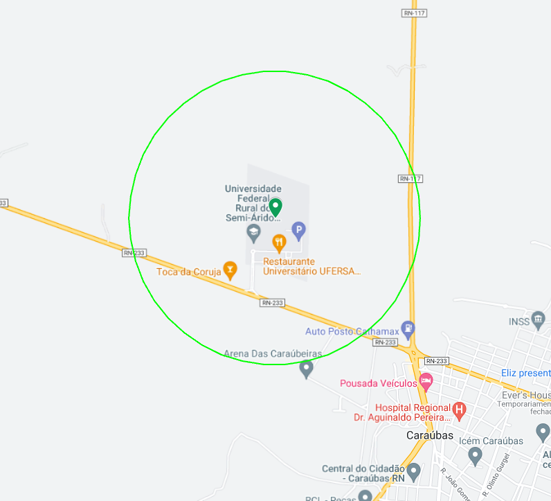
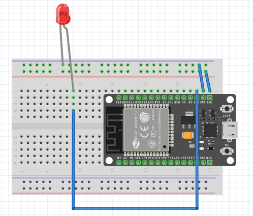

# checker

Projeto de verificador de localização utilizando o microcontrolador ESP32.

# 1. Dispositivos e recursos necessarios

- Protoboard
- LED
- ESP32 ESP-WROOM-32 DEVKit V1
- Fios

# 2. Bibliotecas utilizadas no ambiente de desenvolvimento

- bblanchon/ArduinoJson@^6.20.1
- mikalhart/TinyGPSPlus@^1.0.3
- knolleary/PubSubClient@^2.8

# 3. Parâmetros

| CONSTANTES          | Descrição                                                                              |
| ------------------- | -------------------------------------------------------------------------------------- |
| RXD2                | Pino RXD2 do ESP32. Obs: deve ser conectado ao TX do GPS                               |
| TXD2                | Pino TXD2 do ESP32. Obs: deve ser conectado ao RX do GPS                               |
| GPS_BAUDRATE        | A taxa de transmissão de bits de um sinal serial para o GPS. Obs: Geralmente é de 9600 |
| WIFI_SSID           | SSID da rede WiFi                                                                      |
| WIFI_PASSWORD       | Senha da rede WiFi                                                                     |
| MQTT_SERVER         | Endereço do servidor MQTT                                                              |
| MQTT_PORT           | Porta do servidor MQTT                                                                 |
| MQTT_TOPIC_PREFIX   | Prefixo do tópico MQTT para publicar as coordenadas                                    |
| MQTT_USERNAME       | Usuario do servidor                                                                    |
| MQTT_PASSWORD       | Senha do usuario do servidor                                                           |
| LED                 | Pino referente ao LED interno do ESP32                                                 |
| LED_EXT             | Pino referente ao LED externo ao ESP32 que será utilizado. Obs: verificar o datasheet  |
| LATITUDE_REFERENCE  | Latitude de referência para calcular o distanciamento do dispositivo                   |
| LONGITUDE_REFERENCE | Longitude de referência para calcular o distanciamento do dispositivo                  |
| MAX_DISTANCE        | Raio de distância limite usada para verificar um area. Observação: dada em metros      |
| TOPIC_DRONE         | Tópico MQTT responsavel por receber a localização atual do drone de tempos em tempos   |


# 4. Sistema

Basicamente, a função verifica se o dispositivo está muito longe do local de referência, em outras palavras, se está dentro da área ou não.
Se o dispositivo estiver muito longe, publicará uma mensagem JSON no broker MQTT informando. Se o dispositivo estiver perto, também deve publicar uma mensagem JSON no broker MQTT com uma flag diferente.



# 5. Conexão

Aqui é um exemplo de como deve ser feita a conexão dos dispositivos



# 6. Dto's

```json
    {
        "device": "esp32",
        "sensor": "esp32-00:00:00:00:00:00",
        "distance": "1000000000000000000000000000000.12921393193",
        "isClose": false,
        "referenceLocation":  {
            "lat":"0.000000",
            "lon":"0.000000",
            "max_distance": "100000"
        }
    }
```